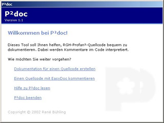

# P²Doc – Dokumentationsgenerator für Profan²

P²Doc für Profan ist ein einfaches Tool mit einer Assistenten-Oberfläche, um Entwickler-Dokumentationen aus Kommentaren in Profan-Quellcode zu erzeugen. Das Werkzeug wurde von gängigen Dokumentationsgeneratoren wie JavaDoc inspiriert und ist kostenlos verfügbar.

